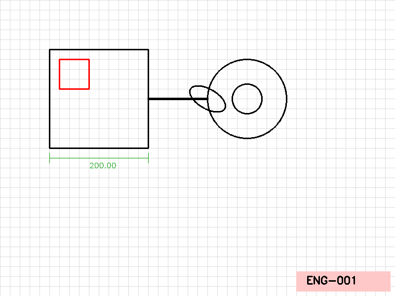
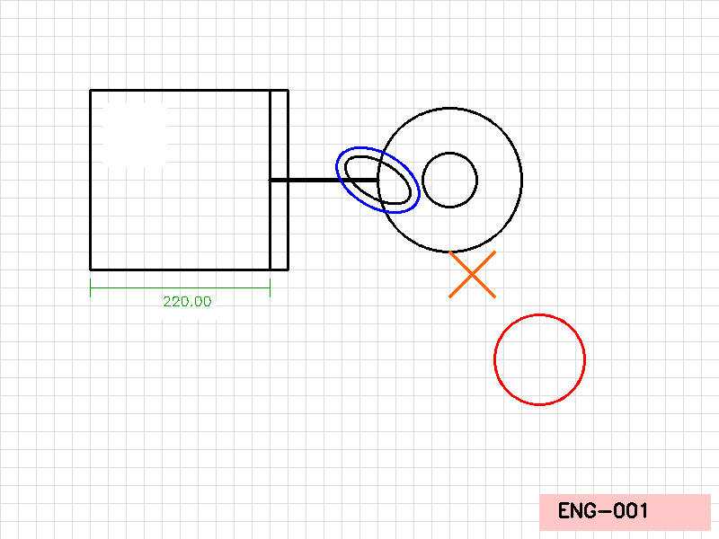

# Image Difference Detection Web App

This project is a modern web application for visually detecting and highlighting differences between two images. It is especially useful for comparing CAD drawings, scanned documents, or any images where you want to see what has changed.

## Features
- Upload two images (original and modified) via a user-friendly web interface
- Automatic alignment of images for robust comparison
- Visual highlighting of all detected changes
- Clean, modern UI built with Flask and Bootstrap
- Example images and results included

## How It Works
1. **Image Upload:** Upload your original and modified images through the web interface.
2. **Alignment:** The app aligns the images using feature matching (ORB algorithm) to correct for shifts or rotations.
3. **Preprocessing:** Both images are converted to grayscale and blurred to reduce noise.
4. **Difference Calculation:** The app computes the absolute difference between the two images.
5. **Thresholding & Dilation:** The difference is thresholded and dilated to highlight significant changes.
6. **Contour Detection:** The app finds changed regions and draws red rectangles around them.
7. **Result Display:** The original, modified, and result images are shown side by side for easy comparison.

## Quick Start

### 1. Clone the repository
```bash
git clone https://github.com/sameerrr786/image-difference-detection.git
cd image-difference-detection
```

### 2. Install dependencies
```bash
pip install -r requirements.txt
```

### 3. Run the web app
```bash
python3 app.py
```

### 4. Open your browser
Go to [http://127.0.0.1:5000](http://127.0.0.1:5000) and use the interface to upload and compare images.

## Example
Below is an example of the app in action. The left image is the original, the middle is the modified, and the right shows detected changes:

<p align="center">
  
  
  
</p>

## Project Structure
```
image-difference-detection/
├── app.py                # Flask web app
├── utils.py              # Image alignment and helper functions
├── requirements.txt      # Python dependencies
├── static/               # CSS and result images
├── templates/            # HTML templates
├── samples/              # Sample images for README
├── .gitignore            # Files to ignore in git
└── README.md             # This file
```

## Credits
- Built with [Flask](https://flask.palletsprojects.com/), [OpenCV](https://opencv.org/), and [Bootstrap](https://getbootstrap.com/)
- Created by [sameerrr786](https://github.com/sameerrr786)

---

Feel free to open issues or contribute! 